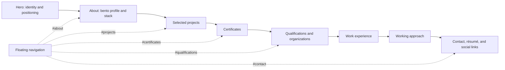
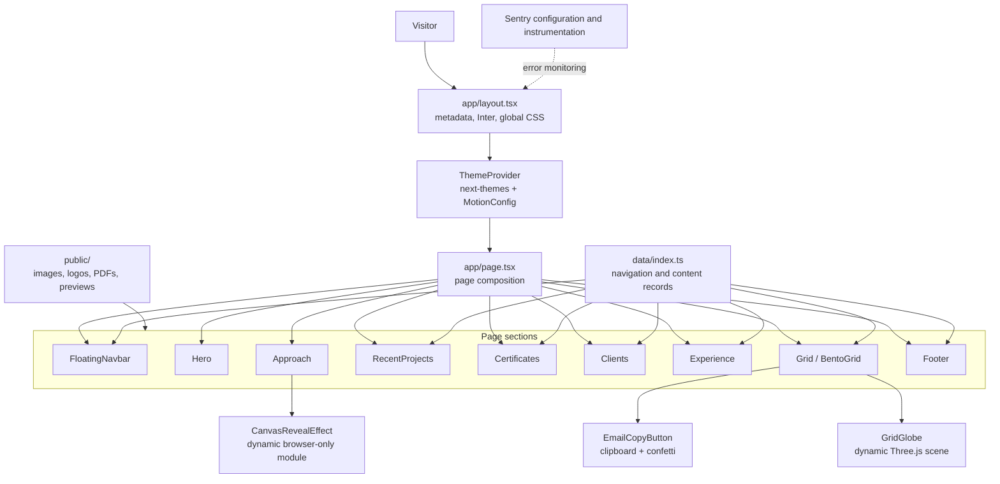
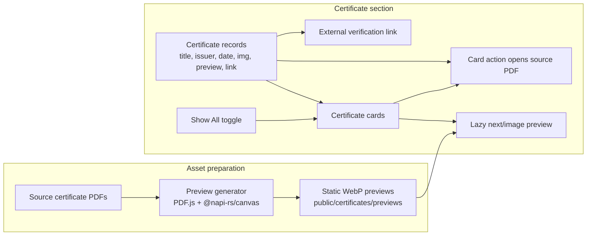

# Haris Khan — Portfolio Case Study

A single-page portfolio that turns a broad software engineering profile into a visual, navigable story: who I am, what I have built, what I have learned, and how to get in touch.

This README documents the product rationale and the implementation visible in the repository. It intentionally focuses on the case study and architecture rather than setup or usage instructions.

## Project at a glance

| | |
| --- | --- |
| **Product** | Personal portfolio and professional contact surface |
| **Author** | Haris Khan |
| **Application shape** | One long-form page built with the Next.js App Router |
| **Content model** | Static TypeScript records in `data/index.ts` |
| **Visual language** | Dark surfaces, purple accents, layered gradients, responsive cards, and motion |
| **Core stack** | Next.js 15, React 18, TypeScript, Tailwind CSS 3, Framer Motion, Three.js / React Three Fiber |
| **Operational integrations** | Sentry for Next.js error monitoring; Vercel tooling is present in the package configuration |

## Case study

### Context and problem

A portfolio has to make several kinds of evidence understandable in one visit: identity, technical range, shipped work, credentials, education, employment history, and a clear contact path. A conventional list of links would make those categories easy to miss and would not express the visual craft of the work.

The site addresses this with a single scroll-based narrative. Each section has a distinct presentation, while the floating navigation provides direct jumps to the main destinations. The content stays locally authored and is rendered from shared records rather than fetched from a content service.

### Experience goals

- Establish identity and positioning immediately in the hero.
- Move from a concise personal introduction into concrete project and credential evidence.
- Keep work history and education scannable without turning the page into a dense résumé.
- Make contact and résumé access available at the end of the narrative.
- Use motion and 3D selectively, keeping primary content and navigation usable without relying on those effects.

### Information architecture

The page order follows a deliberate progression from introduction to evidence and then contact:



| Section | Role in the story | Implementation detail |
| --- | --- | --- |
| **Hero** | States the professional positioning and introduces the portfolio. | Spotlight and grid layers frame the headline; the primary action scrolls to the About section. |
| **About** | Combines personal context, availability, and a compact technology overview. | Responsive bento grid; selected item IDs activate the globe, technology list, and email-copy interaction. |
| **Projects** | Shows project descriptions and associated technology icons. | Horizontally scrollable, snap-aligned cards on narrow screens; cards wrap into a centered layout at larger breakpoints. |
| **Certificates** | Provides credential context with a preview and verification route. | Starts with up to eight cards, with a local “View All” toggle for the full catalogue. |
| **Qualifications** | Presents education and organization marks as a visual carousel. | Infinite moving cards plus a separate row of company logos. |
| **Experience** | Records employment and internship highlights. | Responsive cards with animated border treatment. |
| **Approach** | Describes a three-phase collaboration process. | Hover-reveal cards; the canvas effect is loaded dynamically in the browser. |
| **Contact** | Closes the page with the résumé and external profile links. | Footer CTA opens the résumé; social destinations come from the shared data module. |

### Interaction design

The page uses a small number of purpose-specific interactions rather than adding controls to every visual element:

- **Orientation:** the floating navigation appears while scrolling upward and hides while scrolling downward. Its links target the About, Projects, Certificates, Qualifications, and Contact anchors.
- **Hero transition:** “Show my journey” smoothly scrolls toward `#about`, offsetting the destination for the fixed navigation and viewport.
- **Project browsing:** project cards support horizontal scrolling and scroll snapping on narrow layouts, then become a wrapping grid at the `sm` breakpoint and above.
- **Credential review:** the initial certificate rail is limited to eight records. Certificate previews are lazy-loaded images; selecting a card opens its source PDF in a new tab, while the verification link goes to the record’s external verification URL.
- **Profile interactions:** the About grid’s item with ID `2` hosts the globe, ID `3` displays the technology list, and ID `6` hosts email copy. These IDs are behavioral contracts between `data/index.ts` and `BentoGridItem`.
- **Contact:** the footer exposes a résumé PDF and social links. The email-copy button uses the browser Clipboard API when available and shows a copied state with confetti.
- **Clipboard boundary:** the current handler reports the copied state as soon as `writeText` is called; it does not await or catch a rejected clipboard promise, so that feedback is optimistic.

### Visual system and responsive behavior

The interface uses a dark-first palette with purple emphasis, muted lavender body copy, fine card borders, radial fades, and layered blue/purple gradients. Inter is loaded through `next/font`; global styles and Tailwind utilities define shared page typography and spacing.

Responsive behavior is composed into each section rather than handled by a separate mobile page:

- The About bento grid moves from one column to six columns at `md` and five at `lg`.
- Project and certificate rails scroll horizontally at narrow widths and switch to wrapping layouts at `sm`.
- Work cards change from a single column to four columns at `lg`.
- The qualifications carousel adjusts its container height across viewport sizes.
- `MotionConfig` respects the visitor’s reduced-motion preference; the hero’s small entrance animation is also gated on `prefers-reduced-motion: no-preference`.
- The theme provider defaults to dark and enables system-theme support.

These are implementation choices, not a claim of formal accessibility certification. The source includes useful affordances such as labelled certificate buttons, image alt text, focus rings, and reduced-motion handling; it should still be evaluated as a live interface for full accessibility coverage.

## Architecture

The page is assembled in the App Router. The root layout supplies document metadata, Inter, global CSS, and the theme/motion providers. `app/page.tsx` remains a server component and composes the section components in their reading order. Browser-only behavior stays in client components or dynamically loaded leaves.



### Rendering and data boundaries

- **Composition:** `app/page.tsx` is the single source of section order; section components own their markup and presentation.
- **Content:** `data/index.ts` exports navigation, bento items, projects, certificates, qualifications, companies, work experience, and social links. There is no content-fetching layer; records are imported directly by the sections that render them.
- **Assets:** local images, icons, résumé, certificate PDFs, and generated previews live under `public/`. Components refer to them with root-relative URLs.
- **Client boundaries:** navigation visibility, certificate expansion, clipboard state, the Approach hover effect, and the globe need browser behavior. Those concerns are isolated to client components instead of making the entire page a client component.
- **3D loading:** `GridGlobe` dynamically imports the WebGL `World` component with server rendering disabled. An `IntersectionObserver` activates the globe near the viewport, rather than immediately mounting the scene on initial page load.
- **Motion loading:** the canvas reveal used by the Approach cards is also dynamically imported with server rendering disabled.
- **Rendering cost:** sections marked with `.section-visibility` use CSS `content-visibility: auto` and an intrinsic-size estimate so off-screen content can be skipped by the browser until needed.

## Certificate preview pipeline

Certificate cards do not render PDF documents in the visitor’s browser. The repository contains pre-generated WebP previews; a separate Node script uses PDF.js and `@napi-rs/canvas` to render the first page of each source PDF to a 576-pixel-wide WebP. The browser loads the preview as a lazy `next/image` asset, and opens the original PDF only when a visitor selects the card.



This separates preview rendering from the runtime path: the section can display static image assets without downloading each PDF just to paint its preview. If an image fails, `CertificatePreview` displays “Preview unavailable”. The source PDFs remain available through the card action, and certificate verification remains a separate link.

## Content model

`data/index.ts` is the portfolio’s content catalogue. Its main collections are:

| Collection | Rendered by | Content responsibility |
| --- | --- | --- |
| `navItems` | `FloatingNavbar` | Named page anchors |
| `gridItems` | `Grid` and `BentoGridItem` | About-card copy, layout classes, imagery, and behavior IDs |
| `projects` | `RecentProjects` | Project titles, descriptions, and technology icons |
| `certificates` | `Certificates` | Certificate metadata, source PDF path, preview path, and verification URL |
| `qualifications` | `Clients` / `InfiniteMovingCards` | Education entries and supporting copy/images |
| `companies` | `Clients` | Organization names and logo assets |
| `workExperience` | `Experience` | Role title, description, and thumbnail |
| `socialMedia` | `Footer` | External profile destinations and icons |

The bento item IDs are coupled to rendering logic: `2` selects the globe, `3` selects the stack presentation, and `6` selects the email-copy action. Changing those IDs without changing the matching component behavior would change the rendered card semantics.

## Engineering decisions and trade-offs

### One route, explicit section composition

A single route keeps the portfolio’s narrative linear and makes the section order easy to understand. Dedicated components keep each section focused, while a shared data module avoids duplicating catalogue records in the view layer. This trades the flexibility of a CMS or multiple routes for a compact, code-reviewed content model appropriate to a static personal site.

### Visual richness behind leaf boundaries

The globe and canvas reveal are distinctive but comparatively expensive browser features. Dynamic imports isolate their code from the main section composition; the globe also waits until it approaches the viewport. This retains the visual treatment while avoiding an eager WebGL mount at the top of the page.

### Preview image instead of runtime PDF rendering

Certificate discovery benefits from lightweight image previews, but the authoritative files are still PDFs. Pre-rendered WebP previews keep PDF parsing and canvas rendering in the asset-preparation path; visitors request the PDF only to open it.

### Local state instead of shared application state

The interactions in the inspected page are section-scoped: show-all certificates, copied-email feedback, navigation visibility, and hover state. They use component state and effects; the project has no shared application store or backend service in this flow.

### Measured outcomes

The repository documents implementation decisions and interface behavior, not product analytics or measured conversion/performance results. No numerical impact is claimed here.

## Technical stack and operations

- **Framework:** Next.js App Router (Next.js 15), React 18, TypeScript 5.
- **Styling:** Tailwind CSS 3, global CSS, and `clsx` / `tailwind-merge` through `lib/utils.ts`.
- **Motion:** Framer Motion, including reduced-motion configuration.
- **3D:** Three.js, React Three Fiber, Drei, and `three-globe`.
- **Theme:** `next-themes`, with dark as the configured default and system-theme support enabled.
- **Assets:** Next.js Image for local imagery; PDF.js and `@napi-rs/canvas` are development dependencies for generating certificate previews.
- **Monitoring:** the Next.js configuration is wrapped with Sentry; runtime instrumentation loads the Node or Edge configuration and captures request errors.
- **Deployment integration:** Vercel tooling and a deployment script are present in `package.json`. Their presence describes repository configuration, not a claim that a deployment has been run.

The framework and dependency descriptions above follow the current package manifest. Older documentation or memories that describe a different Next.js version are not authoritative for this repository state.

## Repository map

```text
app/
  layout.tsx                 Document shell, metadata, fonts, providers
  page.tsx                   Single-page section composition
  provider.tsx               Theme and motion providers
  globals.css                Global styles, design utilities, visibility rules
components/
  Hero.tsx                   Opening positioning and hero treatment
  Grid.tsx                   About bento section
  RecentProjects.tsx         Project catalogue view
  Certificates.tsx           Certificate rail and expansion state
  Clients.tsx                Qualifications and organization marks
  Experience.tsx             Work history
  Approach.tsx               Three-phase approach cards
  Footer.tsx                 Contact, résumé, and social links
  ui/                        Reusable navigation, cards, globe, and effects
  CertificateCard.tsx        Certificate open action
  CertificatePreview.tsx    Lazy image preview and failure state
data/
  index.ts                   Navigation and portfolio content records
lib/
  utils.ts                   Shared class-name composition
public/
  certificates/              Source PDFs and generated previews
  ...                        Images, icons, logos, and résumé asset
scripts/
  generate-certificate-previews.mjs
  identify-certs.mjs
instrumentation.ts            Sentry runtime registration
next.config.mjs               Next.js and Sentry configuration
```

## Source map

- [Page composition](app/page.tsx) · [Root layout](app/layout.tsx) · [Theme and motion provider](app/provider.tsx)
- [Content catalogue](data/index.ts) · [Global styles](app/globals.css) · [Class-name utility](lib/utils.ts)
- [Bento behavior](components/ui/BentoGrid.tsx) · [Globe loading boundary](components/ui/GridGlobe.tsx)
- [Certificate section](components/Certificates.tsx) · [Preview component](components/CertificatePreview.tsx) · [Preview generator](scripts/generate-certificate-previews.mjs)
- [Sentry setup](next.config.mjs) · [Runtime instrumentation](instrumentation.ts)
